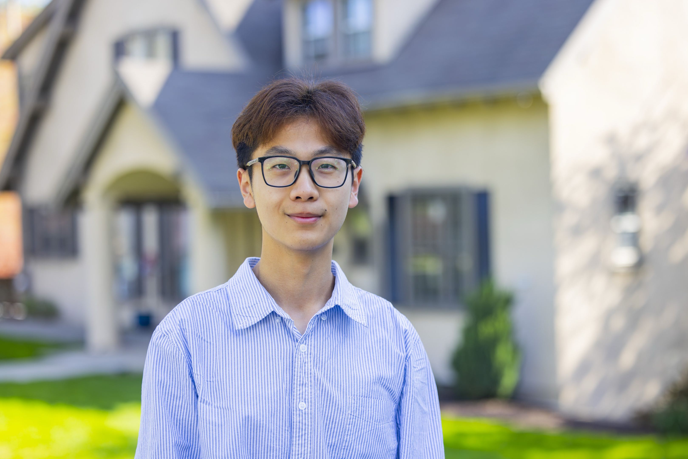

## About Me  

  

Ph.D. student in the Neuroscience Graduate Group at the University of California, Davis. Graduated Phi Beta Kappa & Summa Cum Laude with Joint Honors from Hobart and William Smith Colleges with a Bachelor of Science in Computational Neuroscience and minor in Physics.  

 
 

  
  

  

## Research Interests  

  
  
I am interested in decoding neural signals and interfacing with the brain. My catalyst into mathematics stemmed from a need to interpret neural signals and blossomed into a deep appreciation of its application towards understanding phenomena of the physical world. My coursework in theoretical physics (electromagnetism, quantum mechanics) reaffirmed this admiration; behind abstraction laid truths that become tangible through mathematical rigor.  

  

{: .align-left width="250"}

Your text goes here. Because the image is set to float left, this 
paragraph will wrap around it and sit to its right, filling the 
remaining space. Keep writing as much text as you want — it'll 
continue wrapping alongside the image until the paragraph is 
long enough to clear the image's height, at which point normal 
full-width text resumes below.
