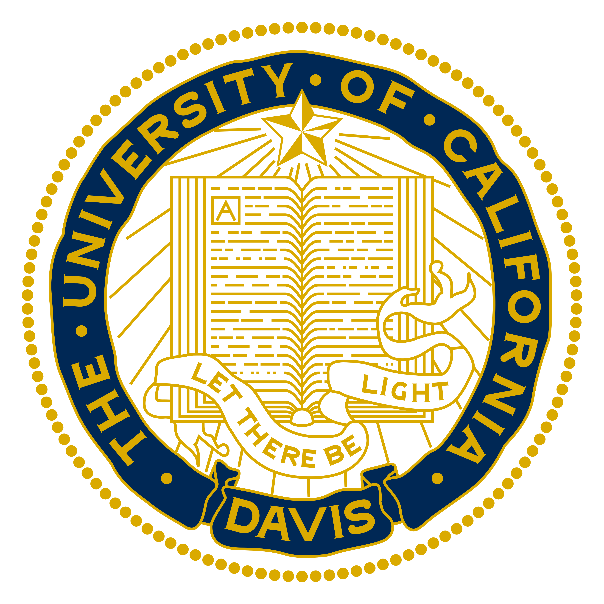
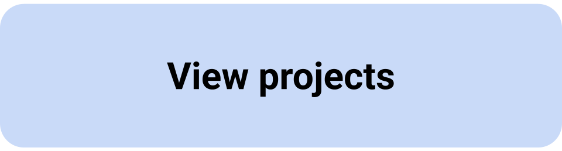

## About Me  

Ph.D. student in the Neuroscience Graduate Group at the University of California, Davis. Graduated Phi Beta Kappa & Summa Cum Laude with Joint Honors from Hobart and William Smith Colleges with a Bachelor of Science in Computational Neuroscience and minor in Physics.  

  
  

 

  
I am a first-generation Vietnamese-American from Los Angeles, California. Witnessing the tribulations of the Vietnamese refugee diaspora instilled a deep passion to uplift demographics suffering from loss. I aspire to contribute to neuroengineering efforts to assist impaired demographics and am interested in problems concerning human rights and systemic violence.  

  

## Scholar Profile  

  
I am interested in decoding neural signals and interfacing with the brain. My catalyst into mathematics stemmed from a need to interpret neural signals and blossomed into a deep appreciation of its application towards understanding phenomena of the physical world. My coursework in theoretical physics (electromagnetism, quantum mechanics) reaffirmed this admiration; behind abstraction laid truths that become tangible through mathematical rigor.  

  

  

  

    
    
  

## Featured Stories

  
  

    <strong style="font-size: 17px;">Randy Hong '26 Built a Mind-Controlled Prosthetic Arm. Next Stop: UC Davis.</strong>
    
HWS Office of Communications

  

  
  

    <strong style="font-size: 17px;">HWS Commencement Speaker Begins Next Chapter in Neuroscience</strong>
    
The Posse Foundation

  

## Contact Me

