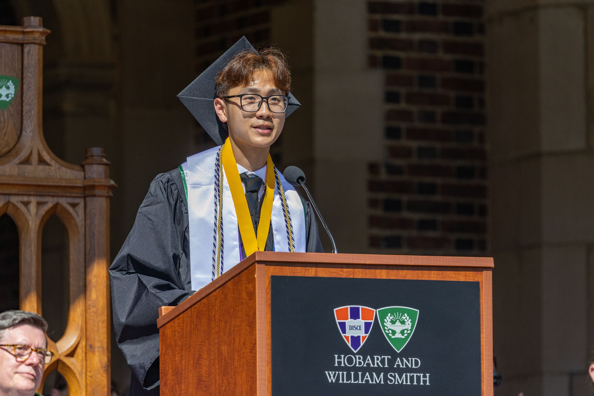

## About Me  

  

Ph.D. student in the Neuroscience Graduate Group at the University of California, Davis. Graduated Phi Beta Kappa & Summa Cum Laude with Joint Honors from Hobart and William Smith Colleges with a Bachelor of Science in Computational Neuroscience and minor in Physics.  

I am a first-generation Vietnamese-American from Los Angeles, California. Witnessing the tribulations of the Vietnamese refugee diaspora instilled a deep passion to uplift demographics suffering from loss. I have aspirations of contributing to neuroengineering efforts to restore motor function of impaired demographics and interested in problems concerning human rights and systemic violence.

 
 

{: .align-center width="65%"}

  

---

## Scholar Profile  

  
  
I am interested in decoding neural signals and interfacing with the brain. My catalyst into mathematics stemmed from a need to interpret neural signals and blossomed into a deep appreciation of its application towards understanding phenomena of the physical world. My coursework in theoretical physics (electromagnetism, quantum mechanics) reaffirmed this admiration; behind abstraction laid truths that become tangible through mathematical rigor.  

[Read more about my research →](/research-interests/)

---

## Featured Stories  

<a href="https://www.hws.edu/news/2026/randy-hong-uc-davis.aspx" target="_blank" style="text-decoration: none; color: inherit;">
  

    
    

      <strong>Randy Hong '26 Built a Mind-Controlled Prosthetic Arm. Next Stop: UC Davis.</strong>
      
HWS Office of Communications

    

  

</a>

<a href="https://www.possefoundation.org/news-and-events/hws-commencement-speaker-begins-next-chapter-in-neuroscience" target="_blank" style="text-decoration: none; color: inherit;">
  

    
    

      <strong>HWS Commencement Speaker Begins Next Chapter in Neuroscience</strong>
      
The Posse Foundation

    

  

</a>

---

## Contact Me

