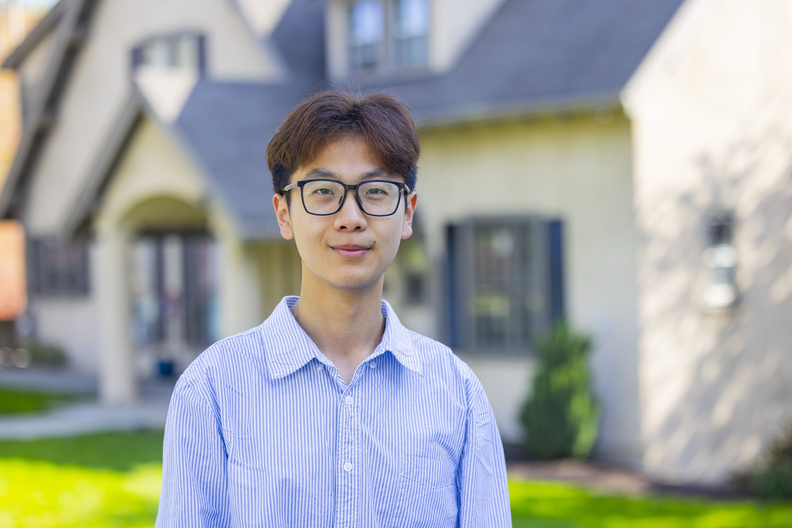
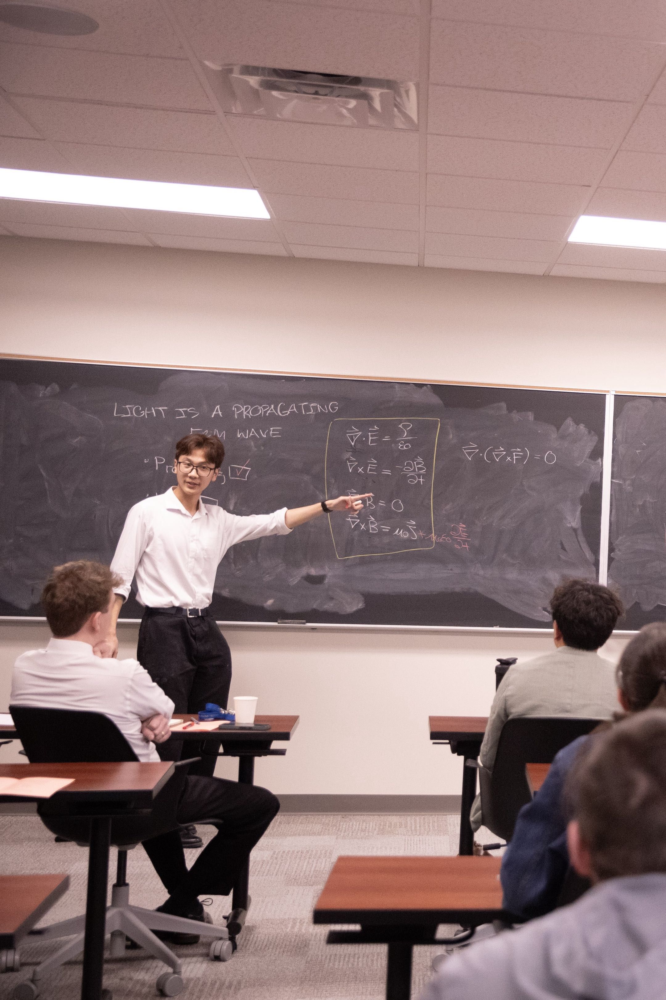

## About Me

  

    
    
    
  

  

  
  

    
Randy Hong

    
Ph.D. Student, Neuroscience Graduate Group &mdash; UC Davis

  

Decoding neural signals to build technology that restores what's been lost.

Ph.D. student in the Neuroscience Graduate Group at the University of California, Davis. Graduated Phi Beta Kappa & Summa Cum Laude with Joint Honors from Hobart and William Smith Colleges with a Bachelor of Science in Computational Neuroscience and minor in Physics. I am a first-generation Vietnamese-American from Los Angeles, California. Witnessing the tribulations of the Vietnamese refugee diaspora instilled a deep passion to uplift demographics suffering from loss. I aspire to contribute to neuroengineering efforts to assist impaired demographics and am interested in problems concerning human rights and systemic violence.

I am interested in decoding neural signals and interfacing with the brain. My catalyst into mathematics stemmed from a need to interpret neural signals and blossomed into a deep appreciation of its application towards understanding phenomena of the physical world. My coursework in theoretical physics (electromagnetism, quantum mechanics) reaffirmed this admiration; behind abstraction laid truths that become tangible through mathematical rigor.

## Featured Stories

  
  

    <strong style="font-size: 17px;">Randy Hong '26 Built a Mind-Controlled Prosthetic Arm. Next Stop: UC Davis.</strong>
    
HWS Office of Communications

  

  
  

    <strong style="font-size: 17px;">HWS Commencement Speaker Begins Next Chapter in Neuroscience</strong>
    
The Posse Foundation

  

## Contact Me

  <a class="contact-card reveal" href="https://www.linkedin.com/in/randy-hong/" target="_blank">
    
Network

    
LinkedIn →

    
Connect with me for professional inquiries.

  </a>
  <a class="contact-card reveal" href="https://github.com/randyhongg" target="_blank">
    
Repository

    
GitHub →

    
Browse the source code behind my projects and research.

  </a>
  <a class="contact-card reveal" href="mailto:randytranhong@gmail.com">
    
Direct

    
Email →

    
Reach out directly to chat about research or collaboration.

  </a>

