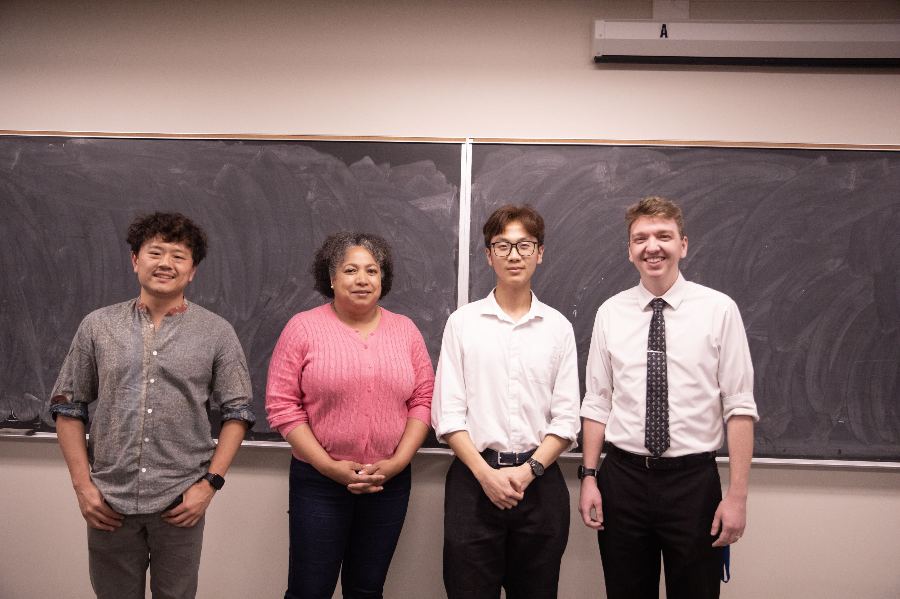
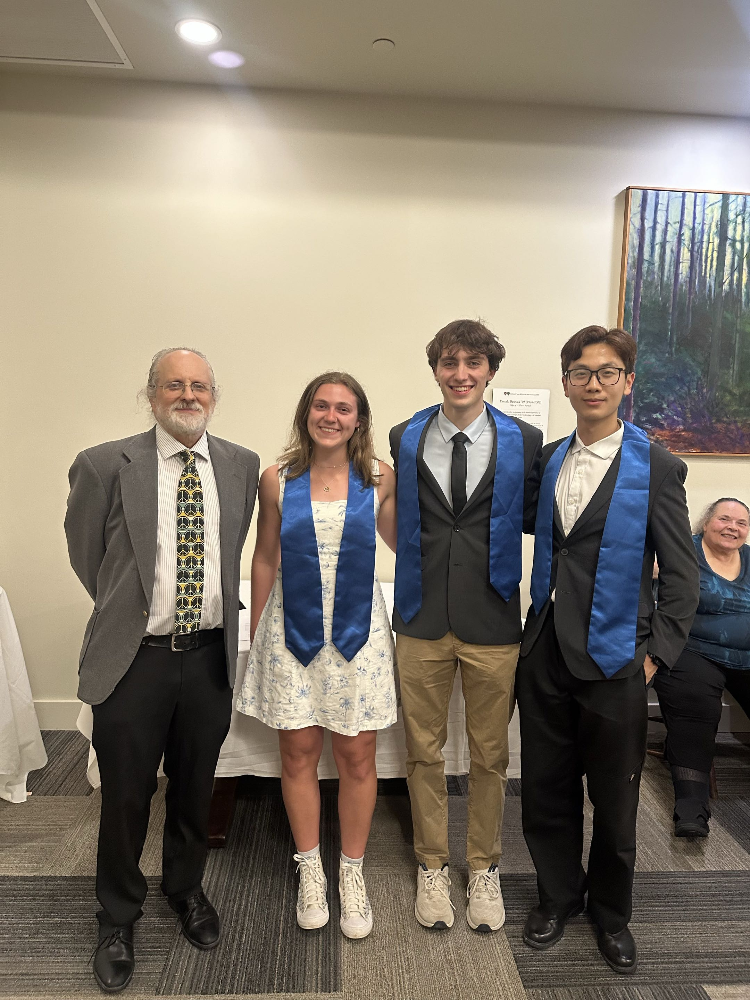
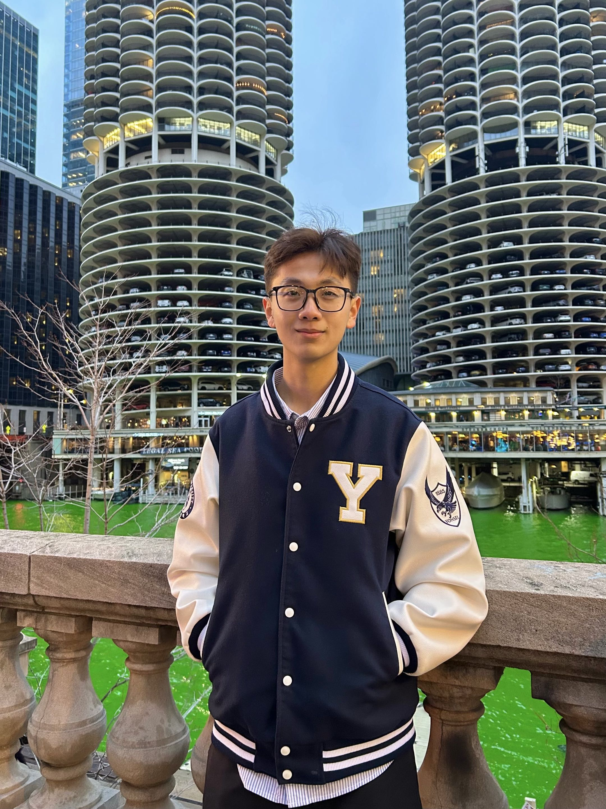
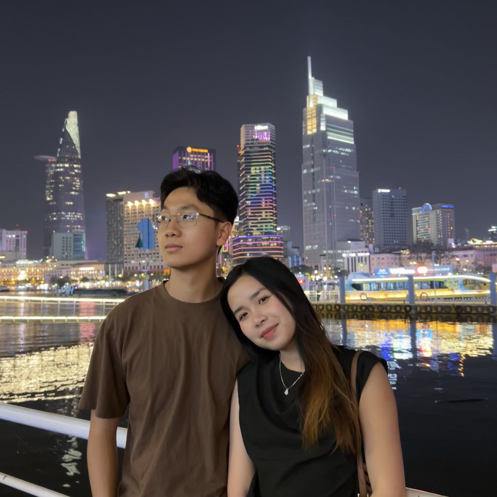

## About Me
{: style="text-align: center;"}

I am interested in decoding neural signals and interfacing with the brain. My catalyst into mathematics stemmed from a need to interpret neural signals and blossomed into a deep appreciation of its application towards understanding phenomena of the physical world. My coursework in theoretical physics (electromagnetism, quantum mechanics) reaffirmed this admiration; behind abstraction laid truths that become tangible through mathematical rigor.

## Photos
{: style="text-align: center;"}

  

    <figure>
      
      <figcaption>Delivering my Speech as the Selected Student Speaker at Commencement, May 2026</figcaption>
    </figure>
    <figure>
      
      <figcaption>Presentation of "Deriving the E&M Wave Equation using Maxwell's Equation", April 2026</figcaption>
    </figure>
    <figure>
      
      <figcaption>Victory Following the 25th Annual Physics Prize Competition, April 2026</figcaption>
    </figure>
    <figure>
      
      <figcaption>Induction into Phi Beta Kappa, April 2026</figcaption>
    </figure>
    <figure>
      
      <figcaption>Chicago River, March 2026</figcaption>
    </figure>
    <figure>
      
      <figcaption>Saigon 2026</figcaption>
    </figure>
    <figure>
      
      <figcaption>NetSci 2026, Boston, MA</figcaption>
    </figure>
    <figure>
      
      <figcaption>NetSci 2026, Boston, MA</figcaption>
    </figure>
  

  

    <button id="photoSliderPrev" aria-label="Previous photo">←</button>
    <button id="photoSliderNext" aria-label="Next photo">→</button>
  

  <button class="photo-lightbox-close" id="photoLightboxClose" aria-label="Close">&times;</button>
  

    
    

  

## Featured Stories
{: style="text-align: center;"}

  
  

    <strong style="font-size: 17px;">Randy Hong '26 Built a Mind-Controlled Prosthetic Arm. Next Stop: UC Davis.</strong>
    
HWS Office of Communications

  

  
  

    <strong style="font-size: 17px;">HWS Commencement Speaker Begins Next Chapter in Neuroscience</strong>
    
The Posse Foundation

  

## Contact Me
{: style="text-align: center;"}

  <a class="contact-card reveal" href="https://www.linkedin.com/in/randy-hong/" target="_blank">
    
Network

    
LinkedIn →

    
Connect with me for professional inquiries.

  </a>
  <a class="contact-card reveal" href="https://github.com/randyhongg" target="_blank">
    
Repository

    
GitHub →

    
Browse the source code behind my projects and research.

  </a>
  <a class="contact-card reveal" href="mailto:randytranhong@gmail.com">
    
Direct

    
Email →

    
Reach out directly to chat about research or collaboration.

  </a>

