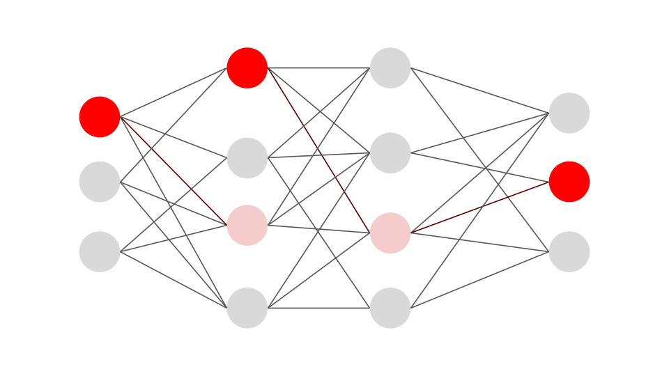

  
  

  <h3 style="margin: 0 0 4px;">sEMG-Based Motor Function Translation of a Prosthesis</h3>
  
Randy Hong, Ileana Dumitriu Ph.D.

  
Using Myoware 2.0 sEMG sensors, we recorded neural signals from the forearm. An ESP32 facilitated wireless transmission of the serial data to a gesture classification model, which sent instructions to an Arduino Uno to rotate motors the fingers of a 3D-printed prosthesis via a PCA9685. This project conluded in an attachable prosthesis capable of recreating humanistic motor function.

  <a href="https://github.com/randyhongg/project-repo" target="_blank" style="font-size: 14px;">View project →</a>

  
  

    <h3 style="margin: 0 0 8px;">Message Flux Imbalance Under Copy-Spread-Annihilate Dynamics Predict Edge Weight Asymmetriers on the Mammalian Brain Connectome</h3>
    
Randy Hong, Yan Hao Ph.D., Daniel Graham Ph.D.

    
The exponential distance rule, relating axonal tract length and connection strength, explains a significant degree of brain connectome topology. However, it fundamentally fails to explain the edge weight asymmetries between opposing directions of bilateral connections. Using the copy-spread-annihilate model, a Markovian-agent message-passing model, we simulated polysynaptic messaging on mammalian brain connectomes to see if message flux imbalance can address asymmetries on the network.

    <a href="https://github.com/randyhongg/project-repo-2" target="_blank" style="font-size: 14px;">View project →</a>
  

  
  

    <h3 style="margin: 0 0 8px;">Movement Intention Classification Using Electrocorticography Beta Frequency Bands and Logistic Regression Model</h3>
    
Randy Hong, Mahmood Ashoory, Julia Suzuki, Hannah Ellis, Niels Pacheco-Barrios M.D.

    
The initiation of motor function is typically reflected by changes in the power of specific frequency bands produced by the brain, and vice versa. Previous studies have demonstrated that recordings of beta frequency bands, produced in the prefrontal cortex, provide us with the greatest predictive capabilities of movement types before its onset. Using the AJILE12 dataset, we extracted beta frequency bands and processed it using a logistic regression model to predict timesteps of motor function initiation.

    <a href="https://github.com/randyhongg/project-repo-2" target="_blank" style="font-size: 14px;">View project →</a>
  

