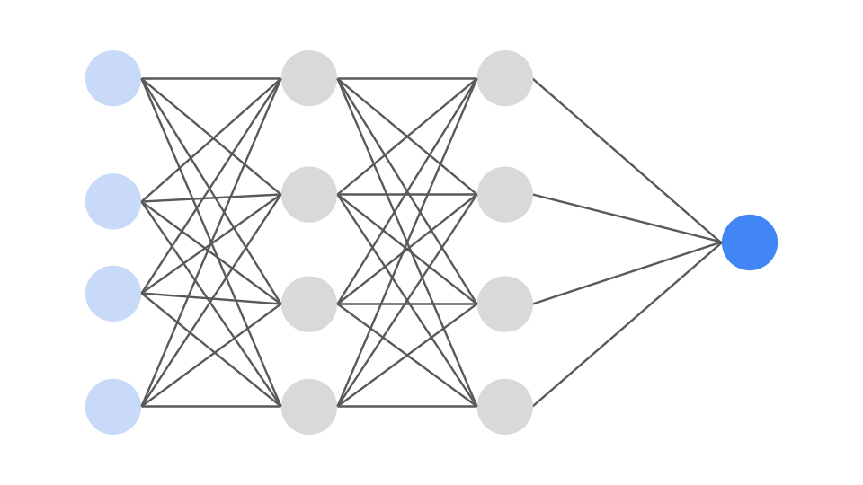
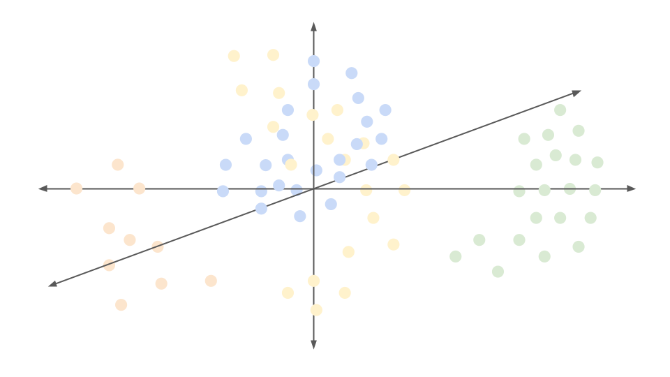
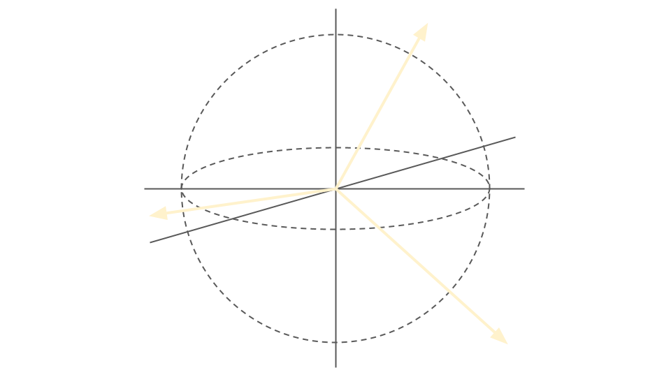
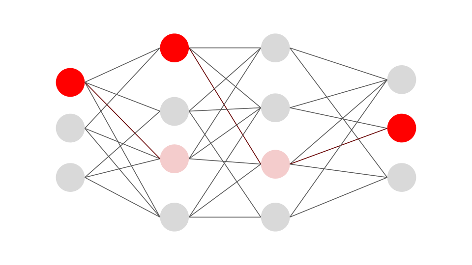

<style>
.page__title {
  display: none;
}
  
**Engineering deep learning algorithms to build more efficient neural interfaces**

  

Artificial neural networks have provided us with an approach towards translating noisy neural signals into motor function control, evident through the successes of prostheses and brain computer interfaces on the market. However, biological heterogeneity and model architectures that demand high quantities of training data have introduced challenges in making this technology accessible and generalizable. I am interested in using neuroscience and mathematical theory to forge approaches that are more cost efficient and accurate than contemporary data analysis methods. Particular interest in engineering non-invasive closed-loop neural interfaces.

  

  
  

**Understanding network dynamics and routing strategies of neural computation**

  

Despite our efforts, we understand very little about how the brain communicates information across its connectome from first principles due to limitations in our measurement tools. Whatever strategy is imposed is clearly very effective and efficient, being able to foster consciousness while consuming the same number of watts as a lightbulb, while only using neurons that are constrained to biophysical restrictions. This is in stark contrast to contemporary artifical intelligence models, which consume high quantities of energy and fail to recreate feats of the brain despite their nodes not being subject to biophysical restrictions. I am interested in studying network dynamics, connectome structure, and information passing strategies to develop biologically-inspired computational algorithms that are cost efficient and effective.  

  
  

## Conference Presentations

- **Hong, R.**, Graham, D., Hao, Y., (2026). “Predicting Edge Weight Asymmetries Using Colliding-Spreading Model Dynamics.” Poster and talk presented at NetSci 2026, Boston, MA.
- **Hong, R.**, Dumitriu, I., (2026). “sEMG-Based Motor Control of Neural Prosthetics.” Poster presented at Rochester Symposium for Physics Students 2026, Rochester, NY.
- **Hong, R.**, Graham, D., Hao, Y., (2025). “Defining Parameters for the Prediction of Asymmetries in Brain Network Dynamics of Mammalian Brains.” Poster presented at Hobart and William Smith Colleges, Geneva, NY.
- **Hong, R.**, Ashouri, M., Ellis, H., Pacheco, N., Suzuki, J., (2025). “Binary Classification of Movement Intention via ECoG Data and Logistic Regression Model.” Research presented at Neuromatch Academy Seminar, Zoom.
- **Hong, R.**, Hassini, L., Simms, J., Jensen, T. (2024). “Using Chloroform to Evaluate Initiation of High Order Brain Function in Brain Embryos at Early Mid-Incubation.” Poster presented at the Rochester Academy of Science Conference, Rochester, NY.
- Anglin, S.M., **Hong, R.**, Poirer, B. (2024). “Public Perceptions of Scientific Uncertainty.” Poster presented at the Eastern Psychological Association Convention, Philadelphia, PA.	
