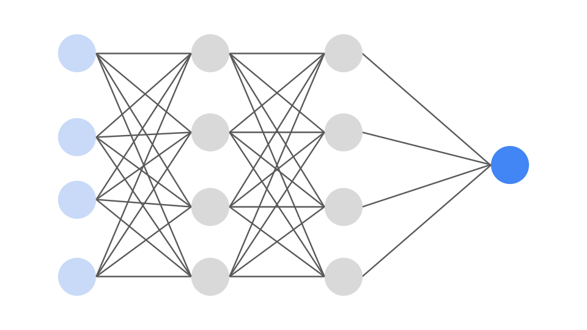
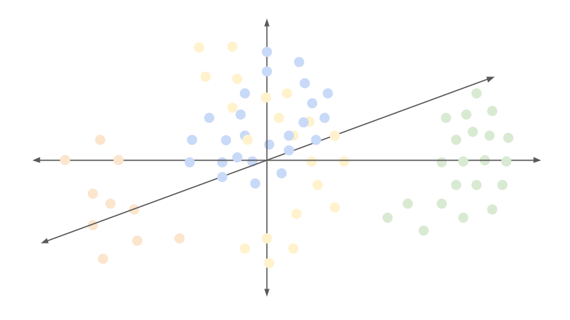
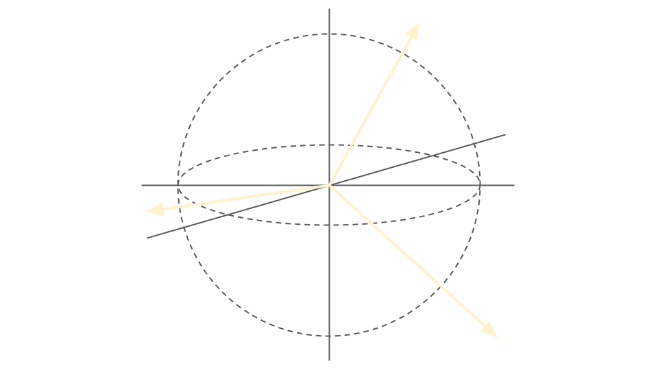
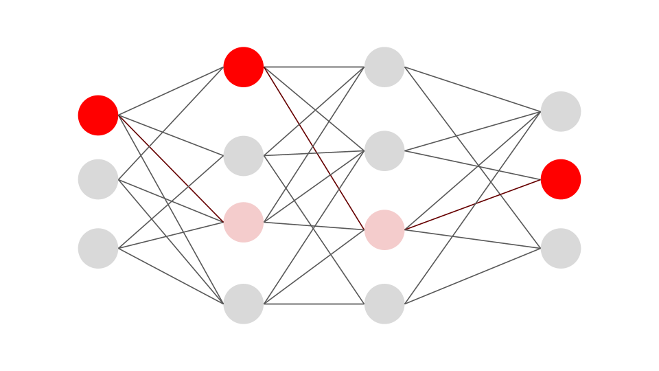
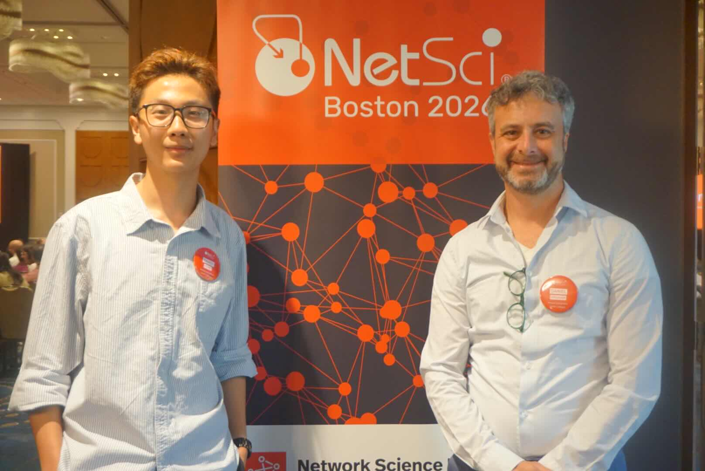
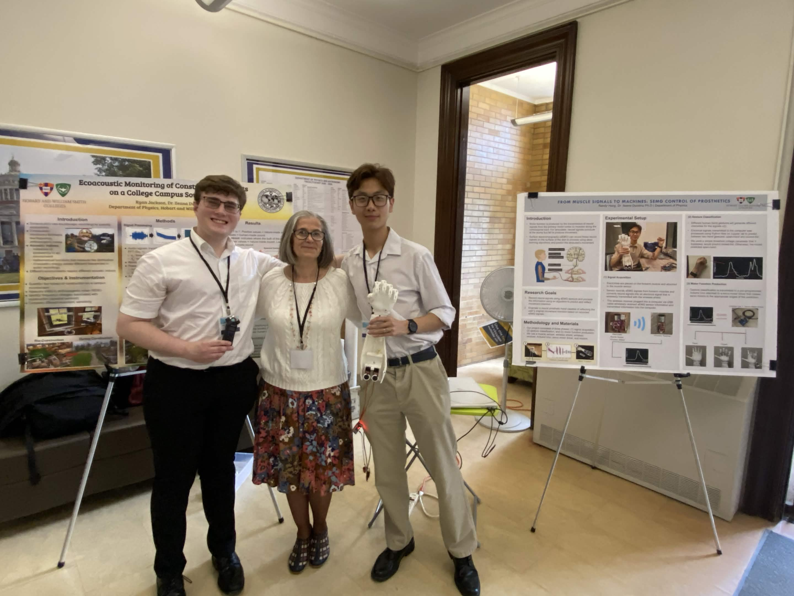
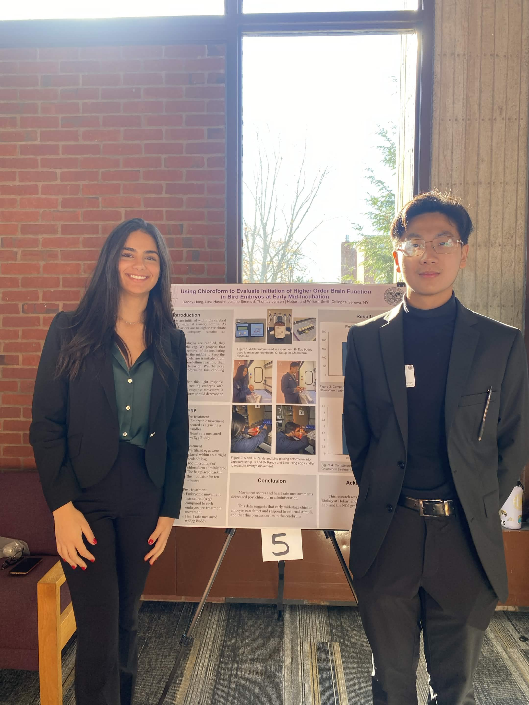
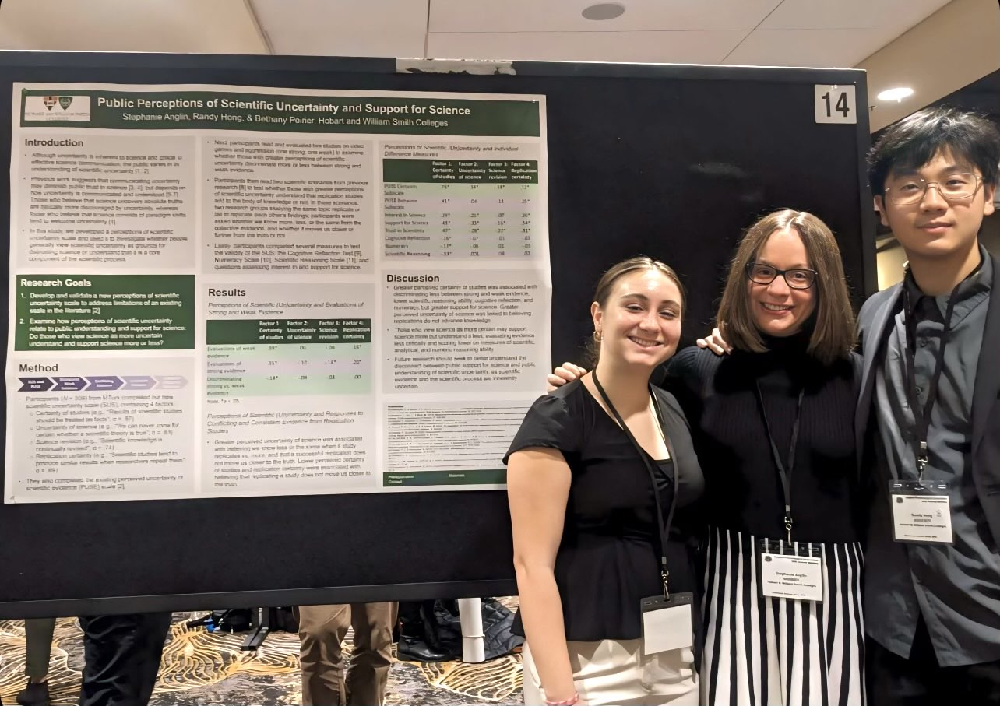

## Research Interests
{: style="text-align: center;"}

Neural interfaces

Engineering deep learning algorithms to build more efficient neural interfaces

Artificial neural networks have provided us with an approach towards translating noisy neural signals into motor function control, evident through the successes of prostheses and brain computer interfaces on the market. However, biological heterogeneity and model architectures that demand high quantities of training data have introduced challenges in making this technology accessible and generalizable. I am interested in using neuroscience and mathematical theory to forge approaches that are more cost efficient and accurate than contemporary data analysis methods. Particular interest in engineering non-invasive closed-loop neural interfaces.

  
  

Network dynamics

Understanding network dynamics and routing strategies of neural computation

Despite our efforts, we understand very little about how the brain communicates information across its connectome from first principles due to limitations in our measurement tools. Whatever strategy is imposed is clearly very effective and efficient, being able to foster consciousness while consuming the same number of watts as a lightbulb, while only using neurons that are constrained to biophysical restrictions. This is in stark contrast to contemporary artifical intelligence models, which consume high quantities of energy and fail to recreate feats of the brain despite their nodes not being subject to biophysical restrictions. I am interested in studying network dynamics, connectome structure, and information passing strategies to develop biologically-inspired computational algorithms that are cost efficient and effective.  

  
  

  <a class="cta-button" href="/projects/">View My Projects →</a>

## Conference Presentations
{: style="text-align: center;"}

  

    <figure>
      
      <figcaption>NetSci 2026, Boston, MA</figcaption>
    </figure>
    <figure>
      
      <figcaption>Rochester Symposium for Physics Students 2026, Rochester, NY</figcaption>
    </figure>
    <figure>
      
      <figcaption>Rochester Academy of Science 2024, Rochester, NY</figcaption>
    </figure>
    <figure>
      
      <figcaption>Eastern Psychological Association 2024, Philadelphia, PA</figcaption>
    </figure>
  

