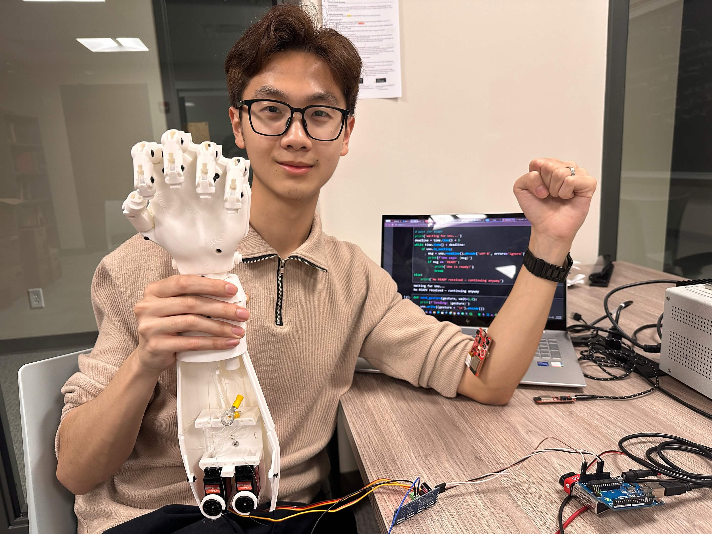
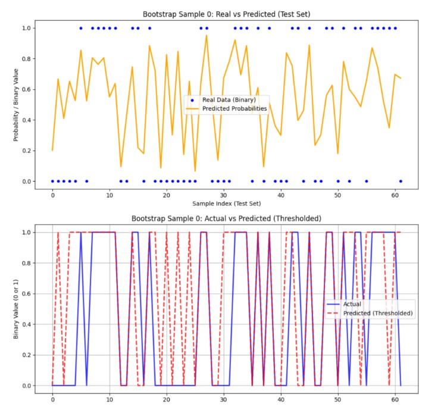

## Research Interests
{: style="text-align: center;"}

**Engineering deep learning algorithms to build more efficient neural interfaces**

  

Artificial neural networks have provided us with an approach towards translating noisy neural signals into motor function control, evident through the successes of prostheses and brain computer interfaces on the market. However, biological heterogeneity and model architectures that demand high quantities of training data have introduced challenges in making this technology accessible and generalizable. I am interested in using neuroscience and mathematical theory to forge approaches that are more cost efficient and accurate than contemporary data analysis methods. Particular interest in engineering non-invasive closed-loop neural interfaces.

  

  
  

**Understanding network dynamics and routing strategies of neural computation**

  

Despite our efforts, we understand very little about how the brain communicates information across its connectome from first principles due to limitations in our measurement tools. Whatever strategy is imposed is clearly very effective and efficient, being able to foster consciousness while consuming the same number of watts as a lightbulb, while only using neurons that are constrained to biophysical restrictions. This is in stark contrast to contemporary artifical intelligence models, which consume high quantities of energy and fail to recreate feats of the brain despite their nodes not being subject to biophysical restrictions. I am interested in studying network dynamics, connectome structure, and information passing strategies to develop biologically-inspired computational algorithms that are cost efficient and effective.  

  
  

## Selected Projects
{: style="text-align: center;"}

  
  

    <h3 style="margin: 0 0 4px;">sEMG-Based Motor Function Translation of a Prosthesis</h3>
    
Randy Hong, Ileana Dumitriu Ph.D.

    
Using Myoware 2.0 sEMG sensors and an ESP32, we recorded and transmitted neural signals from the forearm to a gesture classification model. An Arduino Uno and PCA9685 rotated motors of the fingers of a 3D-printed prosthesis to specific degrees to recreate the hand pose.

    <a href="https://github.com/randyhongg/project-repo" target="_blank" style="font-size: 14px;">View project →</a>
  

  
  

    <h3 style="margin: 0 0 8px;">Message Flux Imbalance Under Copy-Spread-Annihilate Dynamics Predict Edge Weight Asymmetries on Mammalian Connectomes</h3>
    
Randy Hong, Yan Hao Ph.D., Daniel Graham Ph.D.

    
Using a Markovian-agent message-passing model, we simulated polysynaptic messaging on both a mouse and marmoset brain connectome to demonstrate that message flux imbalance can accurately predict bidirectional edge weight asymmetries on mammalian brain networks.

    <a href="https://github.com/randyhongg/project-repo-2" target="_blank" style="font-size: 14px;">View project →</a>
  

  
  

    <h3 style="margin: 0 0 8px;">Movement Intention Classification Using Electrocorticography Beta Frequency Bands and Logistic Regression Model</h3>
    
Randy Hong, Mahmood Ashoory, Julia Suzuki, Hannah Ellis, Niels Pacheco-Barrios M.D.

    
Previous studies demonstrated that recordings of beta frequency bands of the prefrontal cortex provide us with the greatest predictive capabilities of movement types before its onset. Using the AJILE12 dataset, we extracted beta frequency bands and processed it using a logistic regression model to predict the correct timesteps where motor function initiation occurs.

    <a href="https://github.com/randyhongg/project-repo-2" target="_blank" style="font-size: 14px;">View project →</a>
  

## Conference Presentations
{: style="text-align: center;"}

  

    <figure>
      
      <figcaption>NetSci 2026, Boston, MA</figcaption>
    </figure>
    <figure>
      
      <figcaption>Rochester Symposium for Physics Students 2026, Rochester, NY</figcaption>
    </figure>
    <figure>
      
      <figcaption>Rochester Academy of Science 2024, Rochester, NY</figcaption>
    </figure>
    <figure>
      
      <figcaption>Eastern Psychological Association 2024, Philadelphia, PA</figcaption>
    </figure>
  

