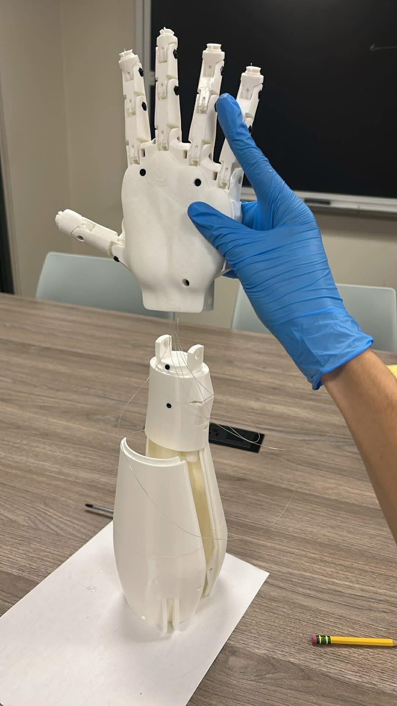
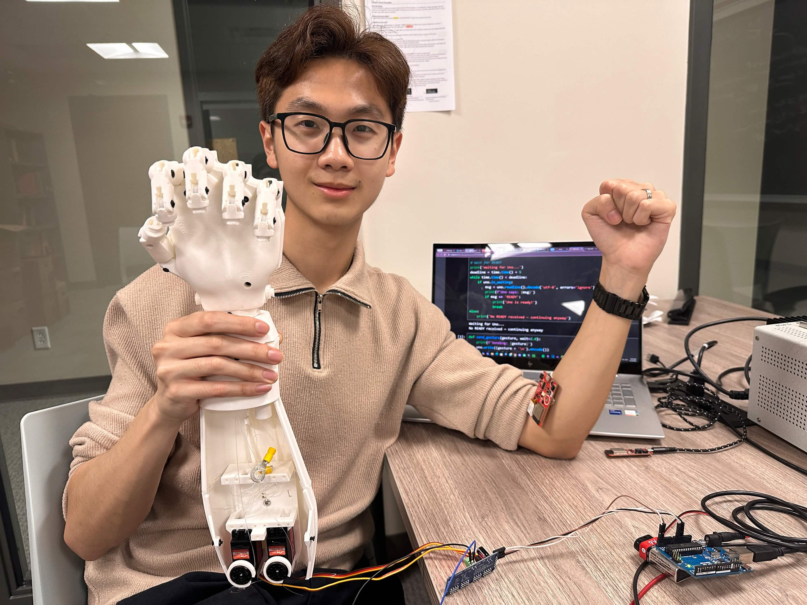
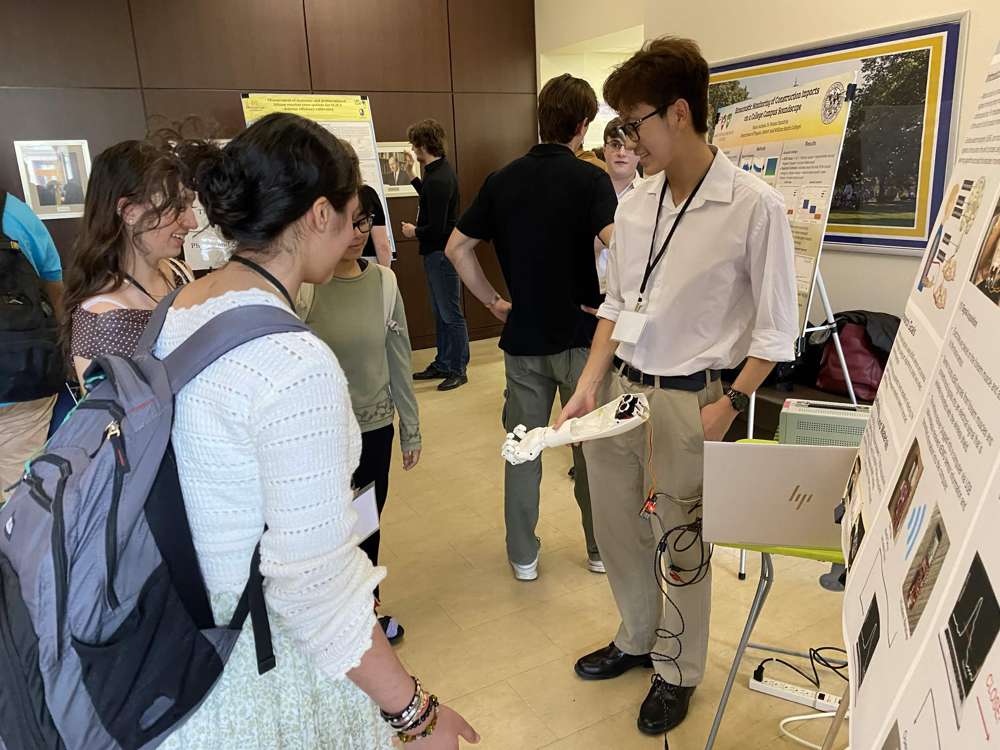
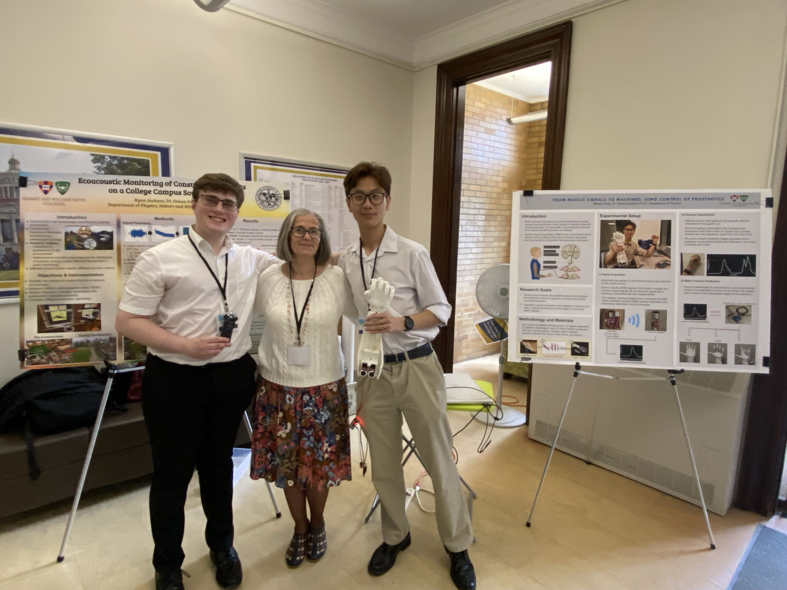

Motor function occurs when neural signals formulate within the brain, traverse down the spinal cord, and arrive at skeletal muscles to produce movement within a limb. For amputees, these neural signals conclude at their stump but fail to produce movement without a limb to innervate. 

We can record these neural signals at the stump using surface electromyography (sEMG), a widely utilized biomedical technique that employs non-invasive sensors to capture electrical activity on the surface of an amputee’s skeletal muscles. By processing recorded neural signals using deep learning algorithms, we can predict an amputee’s movement intention, communicate their movement intention to a prosthesis, and reproduce that movement within the motorized prosthesis.

Consequently, we can engineer a functioning neural prosthetic capable of substituting for an amputee’s missing limb. We demonstrate the recreation of humanistic movement within robotic systems by engineering a motorized prosthetic hand controlled by an Arduino.

  

Using sEMG sensors, we record neural signals to perform gesture classification and decipher the user’s hand gesture from a library of preselected gestures. These predicted gestures are communicated to an Arduino that recreates the predicted gesture in the prosthetic via rotation of the appropriate respective servo motors. 

  

Presented at: Senior Symposium 2026 at HWS, Undergraduate Physics Symposium at the University of Rochester.

  
  

